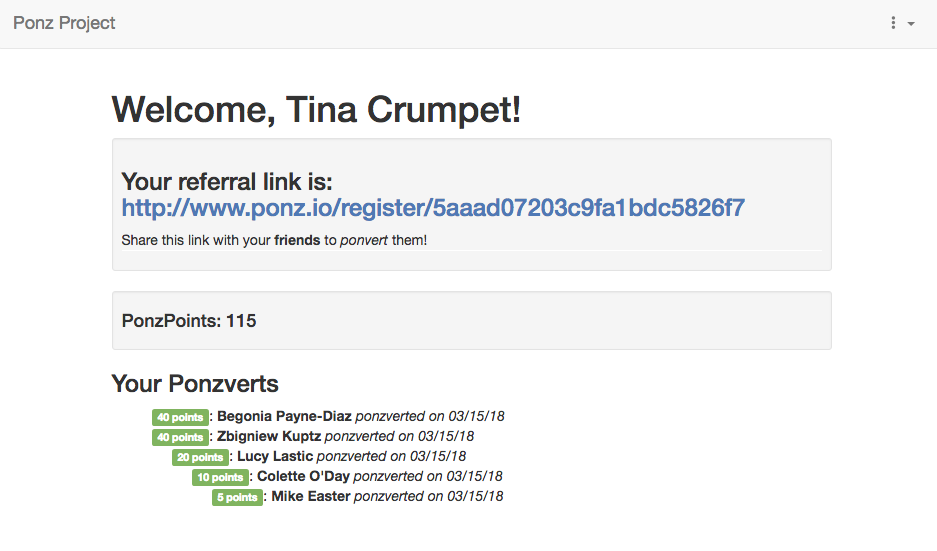

# Ponz.io
Building Ponz.io, with its endearingly upside-down-triangle-shaped business model.

STARTING THE APP

1) After downloading and unpacking the file, navigate to the folder in your command line of choice and run “npm i” to install all the required packages. If you do not have NPM already installed, you can download it at https://www.npmjs.com/.

2) Start up your mongoDB server (installation options at https://docs.mongodb.com/manual/administration/install-community/)

3) Start the server by running ‘node app.js’ in your command line.

4) You can then visit the site by navigating to ‘http://localhost:3000/' in your browser.